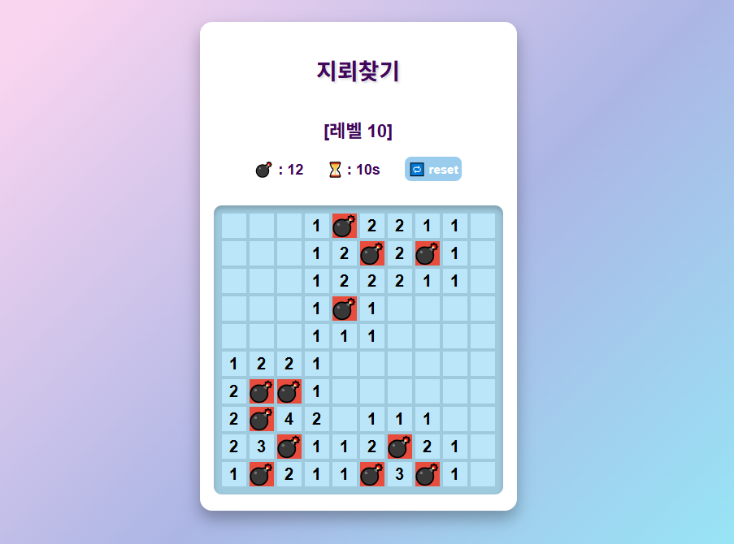

# 지뢰찾기 게임 (Mine Sweeper Game)

레벨에 따라 보드 크기와 지뢰 개수가 증가하여 게임이 진행될수록 난이도가 점점 높아지는 구조입니다.  
<br>
***[지뢰찾기게임 하러가기 Click!](https://carpe-horas.github.io/Mine-Sweeper-Game/)***  

  

<br>

## 주요 기능
- **레벨 시스템**: 레벨이 올라갈수록 보드 크기와 지뢰 개수 증가
- **지뢰 찾기 기능**: 우클릭(마우스 오른쪽 버튼)으로 깃발 표시 가능
- **깔끔한 UI**: 그라디언트 배경, 입체적인 셀 디자인 적용
- **게임 재시작 기능**: 리셋 버튼 클릭 시 새로운 게임 시작  
<br>
 
## 게임 로직 및 알고리즘

#### 1. 무작위 지뢰 배치 (Random Placement)
- 무작위 좌표를 생성하여 지뢰를 배치하고 중복 방지를 위해 Set 자료구조를 사용

#### 2. 셀 공개 및 자동 확장 (Flood Fill 알고리즘)
- 클릭한 셀이 지뢰가 아니면 숫자를 표시, 0이면 연결된 빈 칸을 자동으로 공개
- Flood Fill 알고리즘(재귀 탐색)을 사용하여 주변 8방향을 확장
- 재귀 호출의 깊이를 제한하여 성능 문제를 방지

#### 3. 주변 지뢰 개수 계산 (8방향 탐색)
- 클릭한 셀을 중심으로 주변 8칸을 탐색하여 지뢰 개수 계산

#### 4. 게임 종료 및 승리 조건 검사
- 모든 안전한 칸이 공개되면 승리, 지뢰를 클릭하면 즉시 게임 오버
- 게임 종료 시 모든 지뢰를 공개하여 결과를 확인할 수 있음

#### 5. 레벨 시스템 및 보드 크기 조정
- 레벨에 따라 보드 크기와 지뢰 개수 자동 조정
- 게임 보드 UI 크기를 동적으로 조절하여 화면 크기에 맞게 보드 자동 배치  
<br>

## 사용 기술


  
<br>

## 📂 폴더 구조
```plaintext
📂 Mine-Sweeper-Game
 ├── 📂 css
 │   └── 📄 main.css
 ├── 📂 js
 │   ├── 📄 board.js
 │   ├── 📄 game.js
 │   └── 📄 utils.js
 ├── 📄 index.html
 └── 📄 README.md
 ```
<br>
